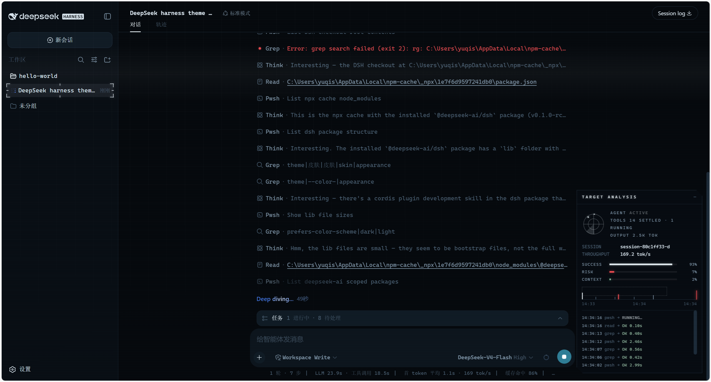
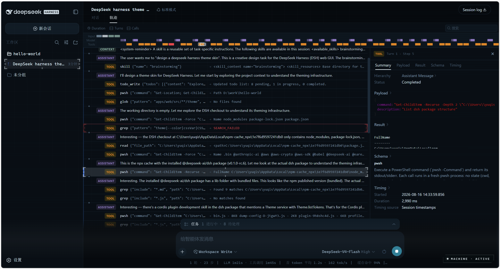

# dsh-theme-machine

**Person of Interest** skin for [DeepSeek Harness](https://github.com/deepseek-ai/deepseek-harness) (`dsh`) — THE MACHINE surveillance-HUD theme for the web UI: deep blue-black surfaces, machine-cyan accents, scanline/grid atmosphere, and a live telemetry panel that makes the UI feel like it's backed by a superintelligence.

> **[简体中文](README.zh-CN.md)**

## Preview





## Features

A THE MACHINE dark HUD skin — applied on install, fully restored to the official look on uninstall.

1. **Token override layer** — repaints the whole UI through `ctx.theme.overrideTokens()` (~50 `--dsw-alias-*` semantic tokens). Install = applied, uninstall = restored. Works on top of the built-in light/dark preference (the skin is dark-only by design and pins both palettes).
2. **HUD chrome** — monospace typography, subtle HUD grid, slow scanline, cyan selection color. Injected as `<style data-plugin>` + two atmosphere `<div>`s, removed on unload.
3. **Live telemetry panel** (`shell.overlay` floating seat, bottom-right):
   - **Radar** — sweeps only while the agent is actually running (`ConversationSnapshot.running`)
   - **SUCCESS / RISK** — real settled tool-call success/error rates (`tool-result` nodes)
   - **CONTEXT** — real context-window occupancy from the token-meter `contextPressure` projection (same source as the official composer ring)
   - **THROUGHPUT** — decode tok/s folded from assistant timing + provider usage
   - **EVENT STREAM** — the session's real tool calls with durations and error states

Collapsed it shrinks to a `MACHINE LINK` pill that pulses while the agent works.

## Install

Requires [DeepSeek Harness](https://github.com/deepseek-ai/deepseek-harness) (`dsh` CLI). Plugins are managed via `dsh plugin`; `--profile web` targets the web profile. Pick one source:

```sh
# from npm (once published)
dsh plugin --profile web add dsh-theme-machine

# from a local checkout
dsh plugin --profile web add link:/path/to/dsh-theme-machine

# from GitHub — pnpm ≥10 will ask you to allowBuilds the prepare script
# (zero-dependency build, see scripts/build.mjs), then re-run the add
dsh plugin --profile web add github:yuqisun/dsh-theme-machine
```

Then:

1. Run the `add` command above.
2. Restart `dsh web` — the skin applies on load.
3. Optional — verify the plugin loaded:

```sh
dsh web --dump-config | grep dsh-theme-machine
```

## Uninstall

```sh
dsh plugin --profile web remove dsh-theme-machine
```

1. Run `remove` to drop the plugin dependency.
2. Restart `dsh web` — the stock look is fully restored.

> Note: if the Loader row was manually written into `$DSH_HOME/cordis.patch.yml`, `remove` won't rewrite that patch line — delete the matching `insert` entry by hand.

## Develop

```sh
node scripts/build.mjs   # emits lib/index.js + lib/client.js (no dependencies)
```

```
├── package.json        # dsh.bundle (cordis patch) + dsh.client (browser half) manifests
├── cordis.patch.yml    # Loader row inserted into the profile composition
├── src/
│   ├── index.js        # host half (placeholder apply)
│   ├── client.js       # browser half: token layer + HUD + telemetry panel
│   └── skin.css        # HUD chrome stylesheet (inlined into the client bundle)
├── scripts/build.mjs   # zero-dep build: wraps client.js into the
│                       # window.__ModuleLoader__.load closure-factory format
└── screenshots/        # demo screenshots shown in the README preview
```

The client bundle runs inside the dsh shell's frozen module table: the only `require()` allowed is platform modules (this skin uses just `react`); everything else arrives via cordis services (`ctx.theme`, `ctx.slots`) and the session-scope standard hooks (`useSession`, `useProjection`).

## Publish

- **npm**: `pnpm publish` (prepack rebuilds `lib/`) — users need no build permission.
- **tarball**: `pnpm pack`, share the `.tgz`; users `dsh plugin add ./dsh-theme-machine-0.1.0.tgz`.
- **GitHub**: works out of the box thanks to the self-contained `prepare`; add the `dsh-plugin` topic so the ecosystem can find it.

## License

MIT
